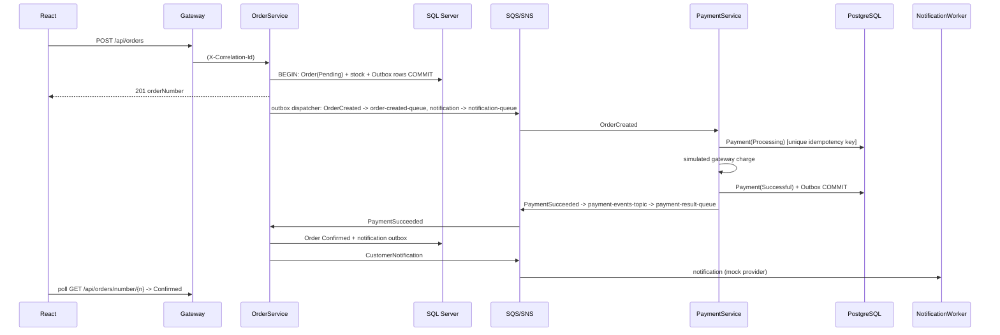
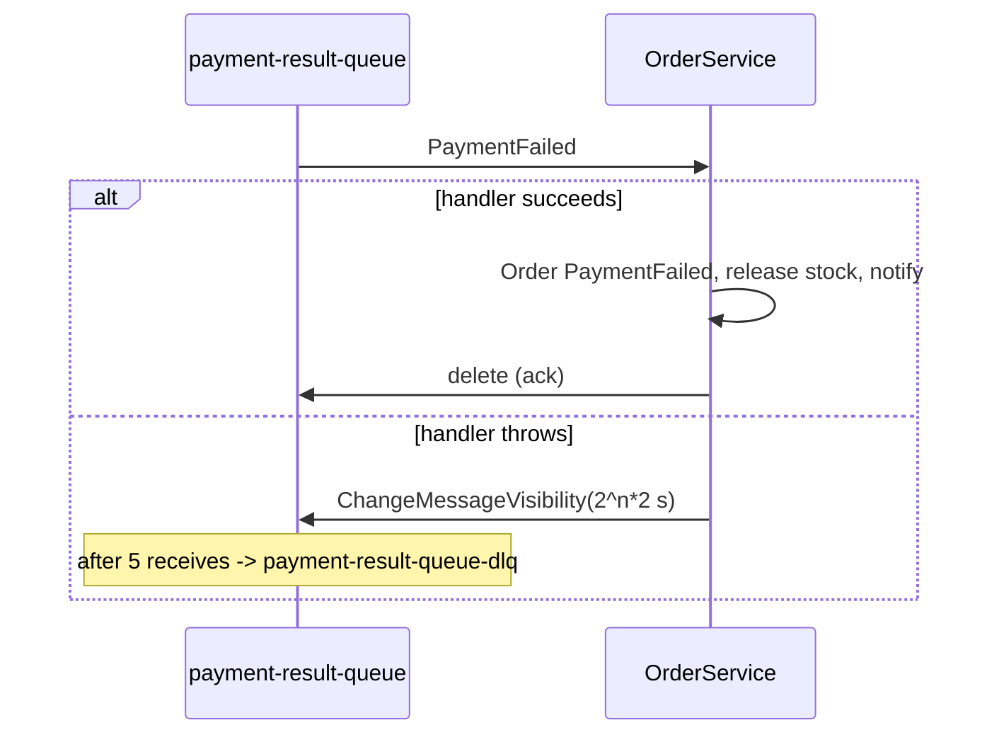
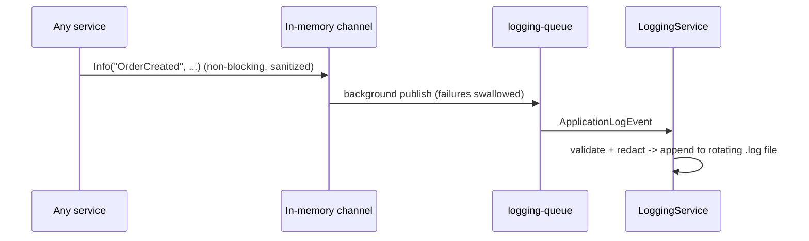

# Sequence diagrams

## Order + payment (happy path)

```mermaid
sequenceDiagram
  participant UI as React
  participant GW as Gateway
  participant OS as OrderService
  participant SQL as SQL Server
  participant Q as SQS/SNS
  participant PS as PaymentService
  participant PG as PostgreSQL
  participant NW as NotificationWorker
  UI->>GW: POST /api/orders
  GW->>OS: (X-Correlation-Id)
  OS->>SQL: BEGIN: Order(Pending) + stock + Outbox rows COMMIT
  OS-->>UI: 201 orderNumber
  OS->>Q: outbox dispatcher: OrderCreated -> order-created-queue, notification -> notification-queue
  Q->>PS: OrderCreated
  PS->>PG: Payment(Processing) [unique idempotency key]
  PS->>PS: simulated gateway charge
  PS->>PG: Payment(Successful) + Outbox COMMIT
  PS->>Q: PaymentSucceeded -> payment-events-topic -> payment-result-queue
  Q->>OS: PaymentSucceeded
  OS->>SQL: Order Confirmed + notification outbox
  OS->>Q: CustomerNotification
  Q->>NW: notification (mock provider)
  UI->>GW: poll GET /api/orders/number/{n} -> Confirmed
```

## Payment failure / retry

```mermaid
sequenceDiagram
  participant Q as payment-result-queue
  participant OS as OrderService
  Q->>OS: PaymentFailed
  alt handler succeeds
    OS->>OS: Order PaymentFailed, release stock, notify
    OS->>Q: delete (ack)
  else handler throws
    OS->>Q: ChangeMessageVisibility(2^n*2 s)
    Note over Q: after 5 receives -> payment-result-queue-dlq
  end
```

## Logging

```mermaid
sequenceDiagram
  participant S as Any service
  participant C as In-memory channel
  participant Q as logging-queue
  participant L as LoggingService
  S->>C: Info("OrderCreated", ...)  (non-blocking, sanitized)
  C->>Q: background publish (failures swallowed)
  Q->>L: ApplicationLogEvent
  L->>L: validate + redact -> append to rotating .log file
```
